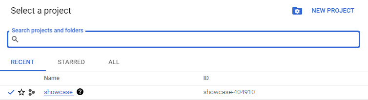

# Narzędzia DevOps'a, czyli dlaczego już nie klikamy w chmurze.

Praca z chmurami obliczeniowymi od ich powstania ewoluowała do stanu, w którym możemy tylko pić kawę.\
No dobra, lekko przesadziłem ;)\

Jednak na rynku pojawił się szereg narzędzi, które ułatwiają automatyzacje pracy zespołów DevOps'owych.\
Jednym z ich rodzajów są narzędzia Infrastructure as Code. Obecnie najpopularniejszym przykładem jest [Terraform](https://www.terraform.io/) od HashiCorp'a\
oraz jego otwartoźródłowy odpowiednik [OpenTofu](https://opentofu.org/).

Ponieważ oba te narzędzia są ze sobą zgodne można używać ich obecnie w pełni zamiennie (jednak twórcy OpenTofu zapowiedzieli rozwój w swoim kierunku).

Drugim popularnym narzędziem jest [Pulumi](https://www.pulumi.com/), które jako pierwsze umożliwiło definiowanie infrastruktury przez odpalenie apliakcji.\
Umożliwia to stosowanie dokładnie tych samych zasad, metod czy systemów do testowania co przy samej aplikacji.\
Zdecydowanie ułatwia to zrozumienie developerom tego jak ich aplikacja będzie żyła na środowisku produkcyjnym.

Przejdź do zabawy, zaczniemy od pulumi właśnie.

Wczesniej musimy zainstalować i zalogować się do google cloud używajac cli pobranego ze strony:\
https://cloud.google.com/sdk/gcloud

Po instalacji zgodnej z dokumentacją używamy komendy:
`gcloud auth application-default login`

i łaczymy nasze konto z cli.

Po drodze stwórzmy strukturę katalogów:
`mkdir -p app && mkdir -p pulumi && mkdir -p terraform`

I umieścimy w katalogu app dwap liki html:
<details>
<summary>index.html</summary>

```html
<!DOCTYPE html>
<html lang="en">

<head>
  <meta charset="UTF-8">
  <meta name="viewport" content="width=device-width, initial-scale=1.0">
  <title>Simple Webpage</title>
  <style>
    body {
      font-family: Arial, sans-serif;
      background-color: #f4f4f4;
      text-align: center;
      margin: 0;
      padding: 0;
      display: flex;
      align-items: center;
      justify-content: center;
      height: 100vh;
    }

    .content {
      background-color: #fff;
      padding: 20px;
      border-radius: 8px;
      box-shadow: 0 0 10px rgba(0, 0, 0, 0.1);
    }
  </style>
</head>

<body>
  <div class="content">
    <h1>You're on, IaC is easy right?</h1>
  </div>
</body>

</html>
```

</details>

<details>
<summary>404.html</summary>

```html
<!DOCTYPE html>
<html lang="en">

<head>
  <meta charset="UTF-8">
  <meta name="viewport" content="width=device-width, initial-scale=1.0">
  <title>Simple Webpage</title>
  <style>
    body {
      font-family: Arial, sans-serif;
      background-color: #f4f4f4;
      text-align: center;
      margin: 0;
      padding: 0;
      display: flex;
      align-items: center;
      justify-content: center;
      height: 100vh;
    }

    .content {
      background-color: #fff;
      padding: 20px;
      border-radius: 8px;
      box-shadow: 0 0 10px rgba(0, 0, 0, 0.1);
    }
  </style>
</head>

<body>
  <div class="content">
    <h1>Oops, we don't have that page here!</h1>
  </div>
</body>

</html>
```

</details>

## Z Pulumi na księżyc? Znaczy do chmury

Instalacja pulumi na linuxie jest banalnie prosta i sprowadza się do jednej komendy:\
`curl -fsSL https://get.pulumi.com | sh`

W przypadku systemu windows skorzystać należy ze strony https://www.pulumi.com/docs/install/,   
gdzie pobrać należy instalator zgodny z wersją systemu.

Zaczniemy od ustawienia lokalnego systemu plików jako backendu pulumi.\
Tak jak kazde narzędzie IaC tak i pulumi posiada swój stan.\
W tym celu uzywamy komendy: 
`pulumi login --local`

Gdy pulumi już wie, że ma używać lokalnego systemu plików możemy przejsc do prawdziwej zabawy.
Cel na dziś to postawienie prostej strony internetowej korzystajac z bucket'a na google cloud.

Zacznimy zatem nowy projekt w pustym katalogu, można skorzystać z poniższej komendy: `mkdir -p pulumi && pulumi new`\
Następnie pulumi porosi nas o wybór wzorca, ja użyje `gcp-javascript`. Następnie samo pulumi przeprowadzi nas przez proces konfiguracji projektu, większosci przypadków klikanie enter wystarczy. Wyjątkiem jest moment, kiedy zostaniemy poproszeni o wskazanie projektu GCP (`gcp:project: The Google Cloud project to deploy into:`), musimy podać jego id.\
Jak widać w moim przypadku jest to `showcase-404910`



Po wpisaniu wybranego id, klikamy enter i czekamy na komunikat: `Your new project is ready to go!`.

Jako domyślny przykład pulumi wrzuca bucket GCP z lokalizacją w US. Taka podstawowa konfiguracja wygląda następująco (plik `index.js`):
```javascript
"use strict";
const pulumi = require("@pulumi/pulumi");
const gcp = require("@pulumi/gcp");

// Create a GCP resource (Storage Bucket)
const bucket = new gcp.storage.Bucket("my-bucket", {
    location: "US"
});

// Export the DNS name of the bucket
exports.bucketName = bucket.url;
```

My ją przerobiomy, bo przecież nie bedziemy ręcznie umieszczać pliku w buckecie, a po za tym to nie jest jeszcze konfiguracja dla strony internetowej.\
Zaczniemy od zmiany lokalizacji, podmieńmy zatem `US` na `EU`.
```javascript
const bucket = new gcp.storage.Bucket("my-bucket", {
    location: "EU"
});
```

Dodajmy jeszcze konfigurację dla hostowania strony internetowej i jednakowych uprawnień dla wszystkich plików:
```javascript
const bucket = new gcp.storage.Bucket("my-bucket", {
    location: "EU",
    website: {
        mainPageSuffix: "index.html",
        notFoundPage: "404.html"
    },
    uniformBucketLevelAccess: true
});
```

Konfiguracja ta mówi tyle, że domyślnie użytkownikowi zwrócić należy stronę z pliku `index.html`, chyba że powiniśmy zwrócić bład 404 to zwracamy zawartość `404.html`.

Dodajmy zatem oba pliki do bucketa:
```javascript
const mainPage = new gcp.storage.BucketObject("main-page", {
  bucket: bucket.name,
  name: "index.html",
  source: new pulumi.asset.FileAsset("../app/index.html")
})

const notFoundPage = new gcp.storage.BucketObject("no-found-page", {
  bucket: bucket.name,
  name: "404.html",
  source: new pulumi.asset.FileAsset("../app/404.html"),

})
```

Teraz umożliwimy dostęp do naszych plików z publicznego internetu:
```javascript
const bucketIamBindig = new gcp.storage.BucketIAMBinding("bucket-iam-bindig", {
  bucket: bucket.name,
  role: "roles/storage.objectViewer",
  members: ["allUsers"]
})
```

W tym przypadku dajemy dostęp do podgladania obiektów (plików) w buckecie wszystkim użytkownikom.

Na koniec jeszcze zmienimy ścieżkę do naszego bucketa, żeby dostać normalne linki:
```javascript
exports.mainPageUrl = pulumi.interpolate`https://storage.googleapis.com/${bucket.name}/${mainPage.name}`
exports.notFoundPageUrl = pulumi.interpolate`https://storage.googleapis.com/${bucket.name}/${notFoundPage.name}`
```

W tym przypadku odnośmy się do nazwy bucketa wygenerowanej w czasie jego tworzenia `bucket.name` oraz mówimy co jets źródłem dla danego pliku.\
W naszym przypakdu są to dwa assety, które są plikami `FileAsset`.
<details>
<summary>Gotowy plik index.js</summary>

```javascript
"use strict";
const pulumi = require("@pulumi/pulumi");
const gcp = require("@pulumi/gcp");

// Create a GCP resource (Storage Bucket)
const bucket = new gcp.storage.Bucket("my-bucket", {
  location: "EU",
  website: {
    mainPageSuffix: "index.html",
    notFoundPage: "404.html"
  },
  uniformBucketLevelAccess: true
});

const mainPage = new gcp.storage.BucketObject("main-page", {
  bucket: bucket.name,
  name: "index.html",
  source: new pulumi.asset.FileAsset("../app/index.html")
})

const notFoundPage = new gcp.storage.BucketObject("no-found-page", {
  bucket: bucket.name,
  name: "404.html",
  source: new pulumi.asset.FileAsset("../app/404.html"),

})

const bucketIamBindig = new gcp.storage.BucketIAMBinding("bucket-iam-bindig", {
  bucket: bucket.name,
  role: "roles/storage.objectViewer",
  members: ["allUsers"]
})

// Export the DNS name of the bucket
exports.mainPageUrl = pulumi.interpolate`https://storage.googleapis.com/${bucket.name}/${mainPage.name}`
exports.notFoundPageUrl = pulumi.interpolate`https://storage.googleapis.com/${bucket.name}/${notFoundPage.name}`
```

</details>

Mozemy zatem stworzyć nasz bucket poleceniem: `pulumi up`, po czym wybieramy `yes`.\
Jako output dostajemy linki do naszych plików:
```shell
Outputs:
  mainPageUrl    : "https://storage.googleapis.com/my-bucket-8b61cb2/index.html"
  notFoundPageUrl: "https://storage.googleapis.com/my-bucket-8b61cb2/404.html"
```

Bucket usuniemy poleceniem `pulumi down`

## Z Terraformem na marsa

Instalacja terraform'a: https://developer.hashicorp.com/terraform/tutorials/aws-get-started/install-cli#install-terraform
Instalacja Open Tofu (Linux): https://opentofu.org/docs/cli/install/apt

Można zrobić alias, żeby używać tofu jak terraforma: `alias terraform=tofu`

W przeciwieństwie do pulumi, terraform korzysta z własnego języka zwanego HashiCorp Language (HCL).
Jego sładnia jest prosta, ale sam język jest ograniczony.
```
<type> <resource> <resource_name> {
  <args>
}
```
Jako typ rozróżniamy `data` i `resource`, przy cyzm tylko `resource` jest zarządzany przez terraforma.\
`Data` służy do pobierania informacji o innych obiektach z api dostawców chmur.

Ponadto wyróżniamy dwa bloki zmienna (variable) i wyjścia (output):
```terraform  
variable "name" {
  value = "value"
}
```

oraz

```terraform  
output "name" {
  value = "value"
}
```

Koncepcja terraforma sprowadza się do providerów, które dostarczają zasoby używane w konfiguracji.\
Stwórzmy plik `main.tf` i skonfigurujmy provider google'a:

```terraform
provider "google" {
  project = "showcase-404910"
  region = "eu-central2"
}
```

Ponownie definiujemy id projektu oraz region, tu mamy warszawę kryjacą się pod `eu-central2`

Dodajmy nasz bucket, ponieważ są one dzielone przez wszystkich użytkowników musimy nadac mu losową nazwę\
w tym celu uzyjemy providera `random` i zasobu `random_id` (ten etap pulumi robił za nas):

```terraform
resource "random_id" "id" {
  byte_length = 8
}

resource "google_storage_bucket" "my-bucket" {
  location = "EU"
  name     = "my-bucket-${random_id.id.hex}"
  website {
    main_page_suffix = "index.html"
    not_found_page   = "404.html"
  }
  uniform_bucket_level_access = true
}
```

Następne jak poprzednio dodajmy nasze pliki, jak widać różnica jest głównie w strukturze:
```terraform
resource "google_storage_bucket_object" "main-page" {
  bucket = google_storage_bucket.my-bucket.name
  name   = "index.html"
  source = "../app/index.html"
}

resource "google_storage_bucket_object" "not-found-page" {
  bucket = google_storage_bucket.my-bucket.name
  name   = "404.html"
  source = "../app/404.html"
}
```

I na koniec dajmy wszystkim dostęp do podgladania plików:
```terraform
resource "google_storage_bucket_iam_binding" "bucket-iam-binding" {
  bucket  = google_storage_bucket.my-bucket.name
  role    = "roles/storage.objectViewer"
  members = ["allUsers"]
}
```

Jak widać referencja do nazwy bucketa jest dłuzsza niz w przypadku pulumi, a sam jezyk jest mocno deklaratywny.\
Na koniec jeszcze wyświetlmy linki w konsoli:

```terraform
output "mainPageUrl" {
  value = "https://storage.googleapis.com/${google_storage_bucket.my-bucket.name}/${google_storage_bucket_object.main-page.name}"
}

output "notFoundPageUrl" {
  value = "https://storage.googleapis.com/${google_storage_bucket.my-bucket.name}/${google_storage_bucket_object.not-found-page.name}"
}
```

<details>
<summary>Gotowy plik terraforma</summary>

```terraform
provider "google" {
  project = "showcase-404910"
  region  = "eu-central2"
}

resource "random_id" "id" {
  byte_length = 8
}

resource "google_storage_bucket" "my-bucket" {
  location = "EU"
  name     = "my-bucket-${random_id.id.hex}"
  website {
    main_page_suffix = "index.html"
    not_found_page   = "404.html"
  }
  uniform_bucket_level_access = true
}

resource "google_storage_bucket_object" "main-page" {
  bucket = google_storage_bucket.my-bucket.name
  name   = "index.html"
  source = "../app/index.html"
}

resource "google_storage_bucket_object" "not-found-page" {
  bucket = google_storage_bucket.my-bucket.name
  name   = "404.html"
  source = "../app/404.html"
}

resource "google_storage_bucket_iam_binding" "bucket-iam-binding" {
  bucket  = google_storage_bucket.my-bucket.name
  role    = "roles/storage.objectViewer"
  members = ["allUsers"]
}

output "mainPageUrl" {
  value = "https://storage.googleapis.com/${google_storage_bucket.my-bucket.name}/${google_storage_bucket_object.main-page.name}"
}

output "notFoundPageUrl" {
  value = "https://storage.googleapis.com/${google_storage_bucket.my-bucket.name}/${google_storage_bucket_object.not-found-page.name}"
}
```

</details>

Pora wdrożyć infrastrukturę, ale najpierw pobierzmy providery:\
`terraform init`

I sprawdźmy czy wszystko zrobiliśmy dobrze:\
`terraform validate`

I na koniec czas na magię:\
`terraform apply`

Wpisujemy `yes` kiedy zostaniemy o to poproszeni, wczesniej mozemy jeszcze zobaczyć co się zmieni.\
I podobnie jak przy pulumi dostajemy nasz bucket oraz dwa linki do plików.

Bucket usuniemy poleceniem `terraform destroy`, oczywiscie tu też musimy potwierdzic wpisujac `yes`.
